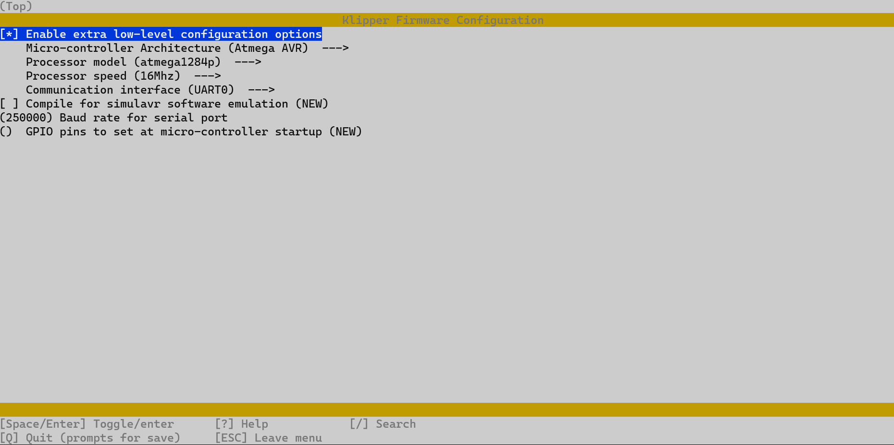

# 1284p Cable Flash

cd into klipper folder. Then config klipper compile option.

```shell
cd ~/klipper
make menuconfig
```

menuconfig setting 



Using make to make `Firmware`

```shell
make
```

Use the following command to determining micro-controller serial id:

```shell
ls /dev/serial/by-id/*
```

It should report something similar to the following:

```shell
/dev/serial/by-id/usb-1a86_USB_Serial-if00-port0
```

Then useing following command to flash micro-controller:

```shell
sudo service klipper stop
make flash FLASH_DEVICE=/dev/serial/by-id/usb-1a86_USB_Serial-if00-port0
sudo service klipper start
```

## Things need notice!

- Wrong config may let mcu lost `bootloader`